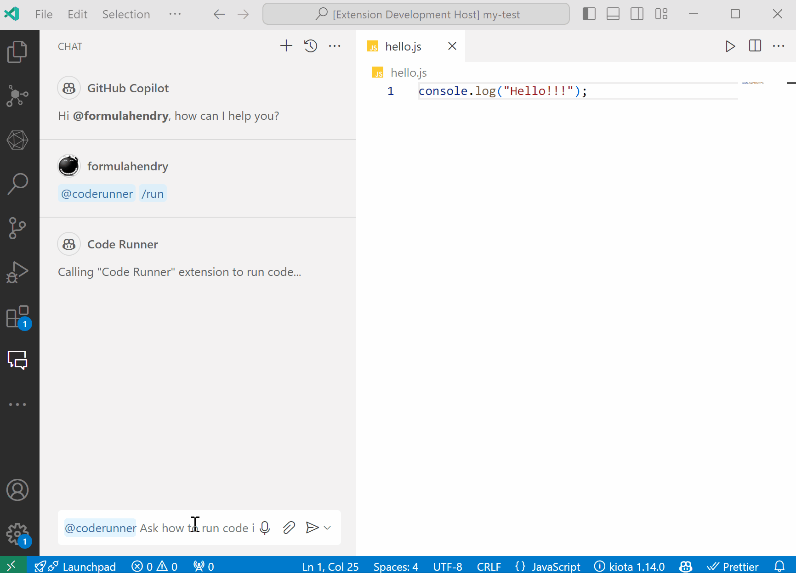
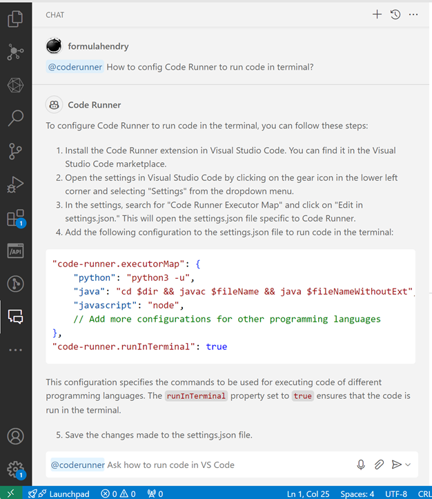

# Code Runner Copilot

Your Copilot to let you use "Code Runner" extension to run code in VS Code with ease

## Note

You need to use thie extension with VS Code Insiders 1.90 or later.

## Features

### Run code

Run active file from GitHub Copilot Chat.

### Ask question

Ask question about how to use and configure "Code Runner" extension to run code.

